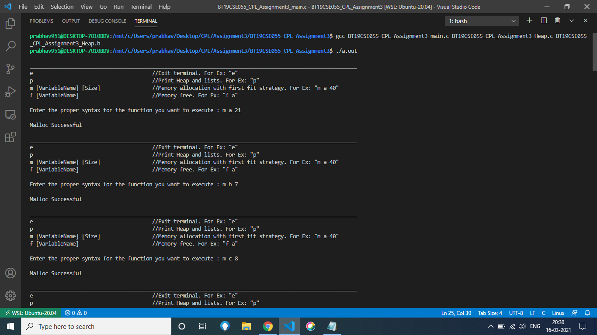
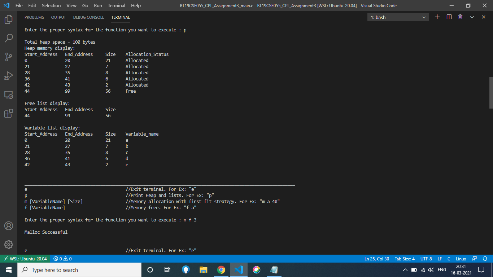
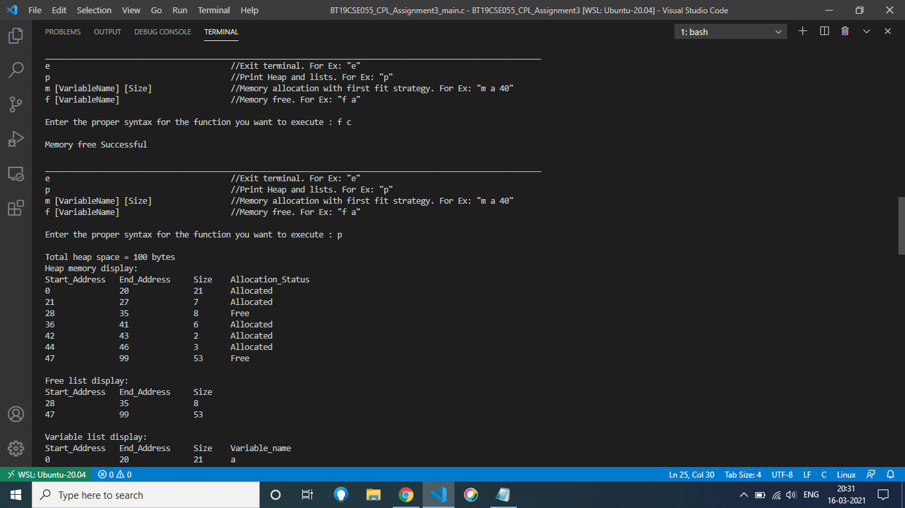
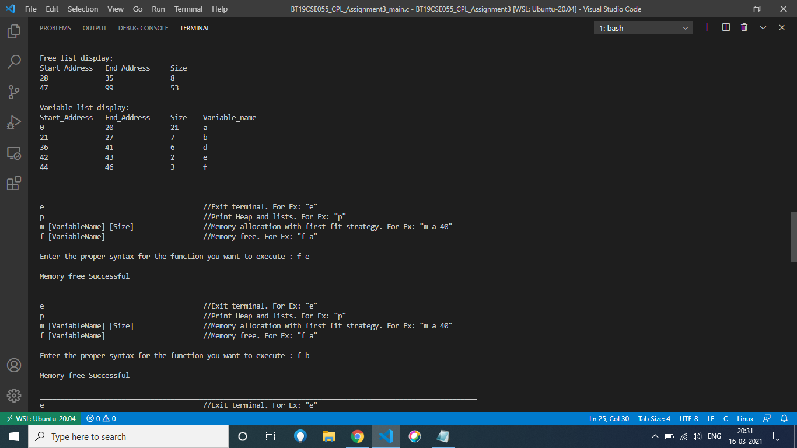
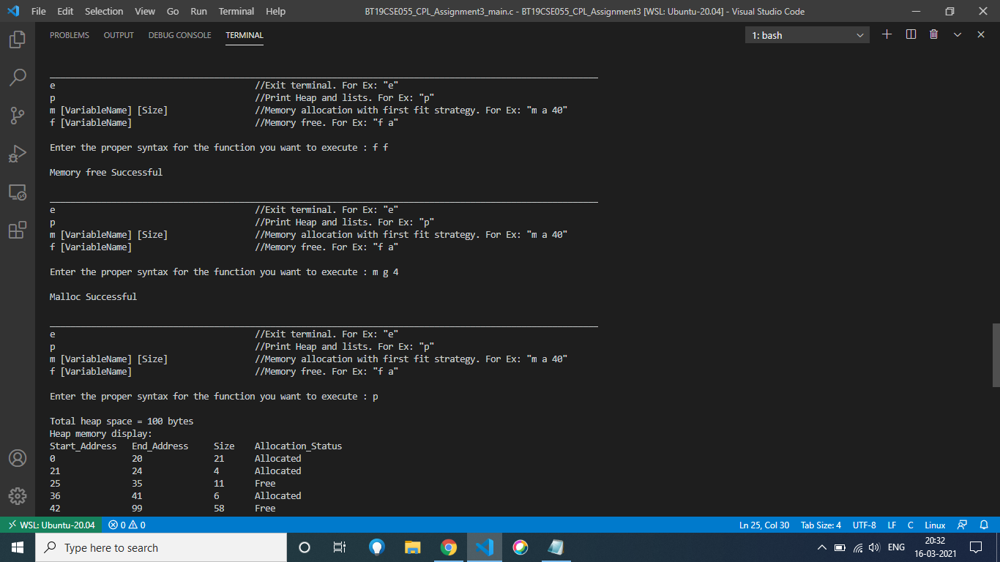
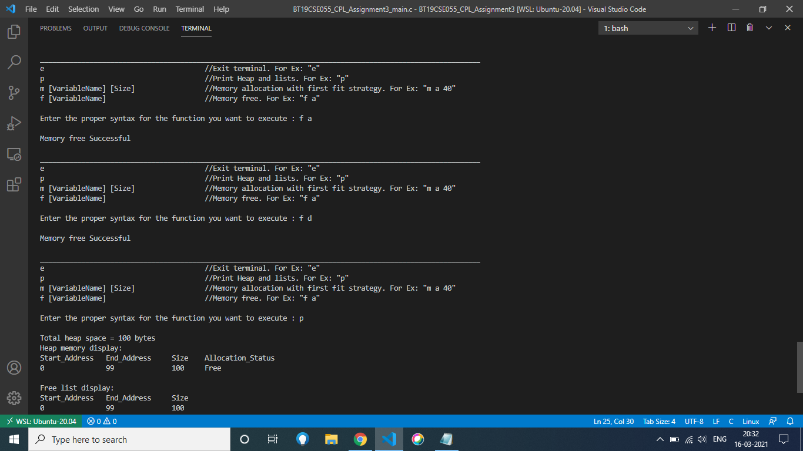
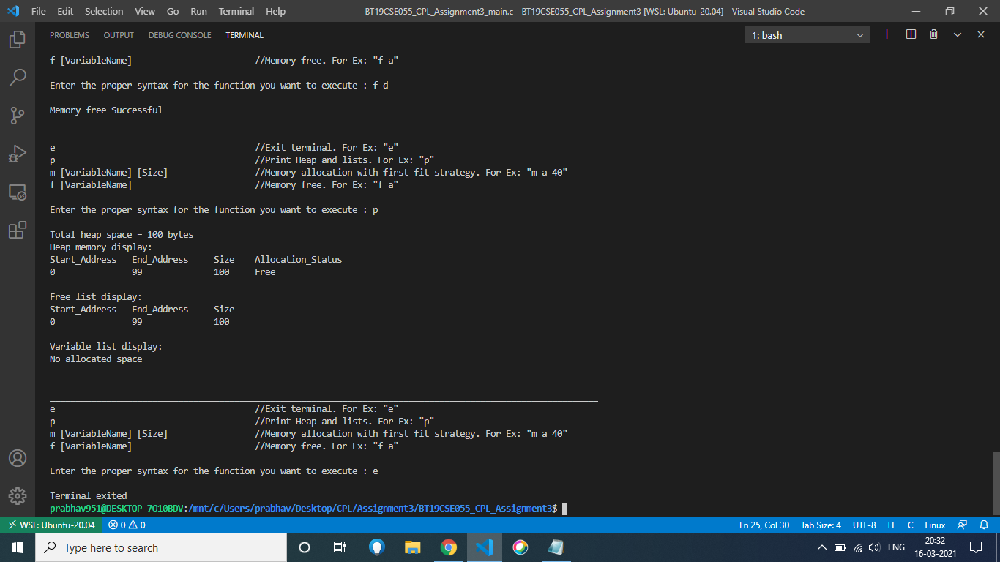

# Heap Management Scheme in C

Heap management scheme is implemented using using a doubly linked list and the first fit allocation strategy.

## Features

- Explicit lists are used to maintain the `Heap`, i.e. two lists, 'freelist' and 'varlist' are maintained, which keep track of the freed and allocated memory blocks respectively.
- `allocate()` and `free()` functions are implemented.
- Adjacent free blocks are merged together.
- 'main.c' is written using the functions mentioned below, and when executed can be used as CLI commands in terminal

## Assumptions
- Memory of the actual stated size is not allocated, only simulated.
- Each byte has an address. 
  - Start Address of a block: Address of the first byte in the block
  - End Address of a block : Address of the last byte in the block
  - In the free/var list, startAddress and size are stored, and end address can be obtained by (startAddress+size-1)
  - Addresses are interpreted as non-negative integers, and start from 0 and end at heap.size-1.
- Memory or free functions can allocate or free memory in positive integral multiples of a byte. Hence the least memory that can be freed is 1 byte, and the least memory that can be allocated is also 1 byte.
- The metadata for the heap block is assumed to be in the allocated memory itself, and won't explicitly specify it.
- Multiple variable name are allowed, and calling the free function on that variable frees the space which was allocated the earliest.

## Usage

`Heap myHeap;`
- creates a `Heap` object 'myHeap', which simulates the memory management of a Heap.

`intializeHeap(&myHeap, 20);`
- initialize the `Heap` 'myHeap' to size of 20 blocks.

`printHeap(&myHeap);`
- prints the memory allocation of `Heap` 'myHeap' in tabular format.

`free_printList(myHeap.freelist);`
- prints the memory blocks in the maintained free list in tabular format.

`var_printList(myHeap.varlist);`
- prints the memory blocks in the maintained allocated list in tabular format.

`firstFitMalloc(&myHeap, varName, size);`
- allocates memory of 'size' memory blocks in the `Heap` 'myHeap' for a hypothetical variable of name 'varName' (`char[]`).
- returns `statuscode`\
`SUCCESS`, if memory is allocated successfully\
`FAILURE`, otherwise
- Internally it finds a memory block in free list according to first fit strategy, and assigns it to the allocated list.

`mfree(&myHeap, varName);`
- frees memory of a variable of name 'varName' (`char[]`),  in the `Heap` 'myHeap'
- returns `status_code`\
`SUCCESS`, if memory is de-allocated successfully\
`FAILURE`, if variable name does't exist
- Internally it finds the memory block of that variable in the allocated list, and assigns it to the free list.
- If adjacent free blocks are present, then they merge into one block.

## Screen Shots

## Video Explanation
https://drive.google.com/file/d/1VdUknZDEFc48lA_O-nD_NUDsi-O3Ivlp/view?usp=sharing